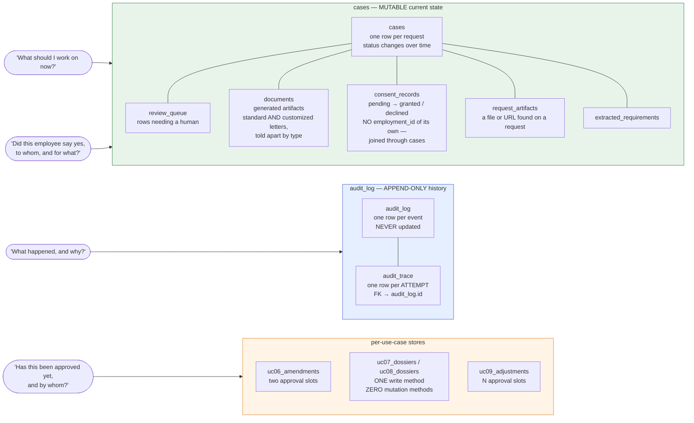

# ARCHITECTURE

How the pieces actually fit together, with the real file names at each step.

Read [`START-HERE.md`](START-HERE.md) first if you haven't — it explains the
problem and the risk-tier idea. This page assumes both and goes one level
down.

**Verified against the code on 2026-08-28.** This pass re-read UC-01 end to
end — the customized-letter disclosure path, the G-3 consent regime and the
third-party door — and checked the live n8n graph against
`qa/evidence/n8n-graph-snapshots/2026-08-28/WORKFLOW_UC01_ID.json`, a snapshot
taken off the running instance the same day. Where something is **built but not
deployed**, this page now says so in the same sentence, because a document that
describes code as if it were running is the failure mode this repository has
paid for most often.

---

## 1. The shape of the whole thing

Five things exist. Everything else is a detail of one of them.

| | What it is | Where it lives |
|---|---|---|
| **Shared foundation** | Money scaling, identity, risk tiers, schema validation, audit, storage, LLM adapter, retry — built once, inherited by all nine use cases. | `src/shared/` |
| **Nine use cases** | One folder each. A *policy engine* (pure decision logic, no AI), a *workflow* (orchestration), and an HTTP API. | `src/uc01/` … `src/uc09/` |
| **Two clients** | REST clients for Remote's API and Zendesk's API, each with a matching local mock server. | `src/remote/`, `src/zendesk/` |
| **The human surface** | A Zendesk sidebar app (browser) plus the API behind it that holds every credential and every gate. | `zaf-app/`, `src/review/` |
| **Nine n8n graphs** | The same decision logic again, as a visual workflow that runs in production without the Node app being up. | `workflows/` |

Plus a measurement layer (`src/metrics/`) and several browser surfaces that
exist so a human can actually *see* the system work.

Three of those surfaces are **intake**, not demo, and the distinction matters
because two of them create real rows:

- **`src/portal/`** — the request-intake page for the eight request types with
  no Remote event API, including UC-01's own self-service letter. Gated by a
  shared key (`PORTAL_ACCESS_KEY`).
- **`src/thirdparty/`** — the third-party consent door. Deliberately
  **unauthenticated**, for a reason §2 explains at length.
- **`src/remoteui/`** — the Remote-native amendment entry point (UC-06).

The rest are for looking: `src/playground/`, `src/chatdemo/`, `src/livedemo/`,
`src/dashboard/`, `src/auditview/`, `src/approvalqueue/` and — new, and the
only one that looks *outward* — **`src/outbox/`**, a read-only page over what
this system actually **delivered**, as opposed to what it wrote onto a ticket.
That distinction was not academic: every verification check in this project had
looked at the ticket and none had looked at the inbox, and **15 auto-resolved
letters** turned out to be addressed to an RFC 2606-reserved `.example.com`
domain that delivers nowhere (measured against the live `your-subdomain` desk on
2026-08-23; the count and the fifteen ticket numbers are in
`src/outbox/server.js`'s header). The system looked as though it only ever did
refusals. It did not — it only ever *delivered* refusals.

---

## 2. A request's full journey

### Where a request comes from — two doors, not one

Zendesk is **not** the universal front door, and treating it as one would be
wrong about what these requests actually are.

- **Four use cases start as a genuine inquiry** (01, 03, 07, 08). *"Can I get
  a letter?" "Can I work from Spain?" "What happens to my taxes?"* Nothing
  was created inside Remote's product — there is no object to react to. The
  **ticket is the request**.
- **Five use cases start as a Remote-native event** (02, 04, 05, 06, 09). The
  employee or admin already *did* something in Remote's own product:
  submitted an expense, filed a work-authorization request, resigned,
  requested a contract amendment, drafted an off-cycle payment. A Remote
  object already models the request, so the automation reacts to the webhook
  directly.

For the second group, Zendesk is not bypassed — it is used *later and more
deliberately*. The gates run against the webhook event first, and only then
does the automation **create the ticket itself** via the API, pre-tagged and
pre-populated with everything already gathered. A human opening that ticket
starts with the facts, not with a raw message.

`docs/adr/0004-trigger-source-per-use-case.md` records this decision.

### UC-01 has THREE doors, and the third one has no lock

The two-door model above is about *what kind of thing* a request is. UC-01 then
splits the first group again, by *who is asking*, and each answer needed its own
surface:

| Door | Who walks through it | What identifies them | `externalRef` |
|---|---|---|---|
| **Zendesk ticket** | the employee, or anyone emailing support | Zendesk's authenticated requester, matched to the email on the Remote record | the ticket id |
| **Third-party door** (`src/thirdparty/`, `npm run thirdparty` → :4048, **deployed** at `/thirdparty`) | a bank, a landlord, a screening vendor | **nobody. There is no credential and there cannot be** | a `randomUUID()` minted by the door |
| **Portal self-service** (`src/uc01/selfServiceLetter.js`, in `src/portal/`) | a signed-in employee asking about themself | their own Remote session, compared to the employment id being asked about | a `randomUUID()` |

**The third-party door is unauthenticated on purpose, and that is the whole
design rather than a gap in it.** Every other surface in this repository
authenticates a persona first. A bank does not hold a `PORTAL_ACCESS_KEY`, and
requiring one would not be a stronger gate — it would be a different channel,
and it would make the very criteria this surface exists to demonstrate
unrunnable from outside. What makes leaving it open safe is not a gate but an
output guarantee, described next.

**Its one invariant is VC-33: existence is itself a disclosure.** A request
about (a) a real employee who has not answered yet, (b) a real employee who
declined, and (c) a person who does not exist at Remote at all must be
**indistinguishable from outside** — same wording, same status code, same shape.
The obvious implementation, branching on what the workflow decided and replying
accordingly, is exactly the failure VC-33 was written to catch, because every
natural implementation returns early on "no such record".

So the handler is built the other way round. `THIRD_PARTY_ACK_MESSAGE` in
`src/thirdparty/server.js` is a **parameterless constant**: not a template, not
a function of the decision, not a function of whether the employment resolved,
not a function of whether an error was thrown. **No branch can select it,
because nothing branches to produce it** — every code path that reaches a
response reads the identical literal. That is a structural proof rather than a
sampled timing comparison. The real workflow still runs underneath in full: the
classification, the Remote read, the consent lookup, the case row, the audit
rows. Nothing it computes reaches the HTTP response at all.

The portal's self-service path is the opposite kind of separation. It is
**deliberately not `handleVerificationTicket()` run a second way** — it shares
exactly three things with the ticket-driven path (`engagementEligibility.js`,
`REQUIRED_LETTER_FIELDS` and the one `letter.js` template, so the
no-compensation guarantee is never a second copy of itself) and nothing else.
There is no classifier, because a click is not a sentence; and no third-party
regime, because self-service is by definition the self path. It exists because
G-2's deflection message had been telling employees to use Remote's Requests tab
since the day it shipped, pointing at a destination this repository had never
built.

### The journey, step by step

Using UC-01 (`src/uc01/workflow.js`) as the reference — the other eight
follow the same skeleton with their own gates, and none of them has UC-01's
consent regime or its disclosure path.

```mermaid
flowchart TD
    subgraph DOORS ["0 · THREE DOORS, ONE DECISION"]
      D1["Zendesk ticket<br/>externalRef = ticket id"]
      D2["Third-party door — src/thirdparty/<br/>UNAUTHENTICATED, by design<br/>externalRef = randomUUID()"]
      D3["Portal self-service<br/>selfServiceLetter.js — no LLM"]
    end

    D1 --> CLS
    D2 --> CLS
    D3 --> SSL["Shorter ladder: G-1, own-record identity,<br/>status, record complete<br/>SELF_SERVICE_GATE_SEQUENCE"]

    subgraph INTERPRET ["1 · INTERPRET — the only AI step"]
      CLS["classifier.js<br/>LLM reads free text"] --> VAL{"strict shape check"}
      VAL -- "no / error / no key" --> FB["rule-based fallback<br/>source: rule_based_fallback"]
      VAL -- yes --> OK["source: llm"]
      OK --> CAN["canonicaliseRequestedField()<br/>the model's SPELLING becomes<br/>contract vocabulary"]
      FB --> CAN
    end

    CAN --> EMP

    subgraph FACTS ["2 · READ — authoritative facts, never the ticket"]
      EMP["getEmployment()<br/>STEP 2, and STEP 2a's second read for G-1"] --> WHO["requester type is DERIVED<br/>STEP 2b — never the model's opinion"]
      WHO --> CONS["findConsentArtifact()<br/>STEP 2c — scoped by employment<br/>+ requesting party + purpose"]
      CONS --> IDG["verifyRequester()<br/>STEP 3 — authenticated signal only"]
    end

    IDG --> R1

    subgraph LADDER ["3 · DECIDE — 13 rungs, first failure wins, no AI past this line"]
      R1["rung 1 · G-1 engagement eligibility<br/>is Remote the legal employer at all?"] --> R2
      R2["rung 2 · identity — and G-3 consent"] --> R3
      R3["rungs 3–7 · status · third-party disclosure ·<br/>in scope · no artifacts · standard letter"] --> R8
      R8["rungs 8–9 · over-scope disclosure"] --> R10
      R10["rungs 10–12 · confidence · record complete"] --> R13
      R13["rung 13 · outcome"]
    end

    R1 -- "not an EOR engagement" --> BLK
    R2 -- "nobody has answered yet" --> PEND["awaiting_employee_consent<br/>A PENDING STATE, NEVER A REFUSAL"]
    R2 -- "the employee declined" --> BLK["blocked / escalate<br/>terminal — never escalated onward"]
    R3 -- "third_party_request<br/>(consent GRANTED)" --> HR
    R8 -- "asked for salary / hours / end date" --> HR["human_review"]
    R13 -- "G-2: a signed-in employee<br/>can self-serve" --> DEFL["deflected_to_self_service<br/>→ points at door 3"]
    R13 -- all_gates_passed --> AUTO["auto_resolve"]

    PEND --> CLAIM
    BLK --> CLAIM
    HR --> CLAIM
    DEFL --> CLAIM
    AUTO --> CLAIM

    CLAIM["claimExternalRef()<br/>STEP 6 pre — the PRIMARY KEY on<br/>(use_case, external_ref) is the guarantee"] --> STORE["caseStore — STEP 6a–6c<br/>cases + review_queue + documents<br/>+ the PENDING consent_records row"]
    STORE --> AUD["audit.logDurable()<br/>STEP 7 — DURABLE BEFORE ANY OUTWARD ACTION"]
    AUD --> OUT{"STEP 8 — close the loop"}

    OUT -- auto_resolve --> LSTD
    OUT -- "human_review · Zendesk-originated" --> NOTE["internal note + queue tag<br/>on the EXISTING ticket"]
    OUT -- "human_review / escalate ·<br/>third-party door" --> TPT["zendesk.createTicket() — a NEW internal ticket.<br/>Requester is THE DOOR, never the enquirer.<br/>linkTicket() + portal_reference_relinked"]
    OUT -- "blocked · awaiting_employee_consent" --> NOONE["no ticket, deliberately —<br/>the EMPLOYEE owns both of these,<br/>and there is nothing yet to hand off"]

    NOTE --> SPEC
    TPT --> SPEC{"a specialist decides,<br/>in the ZAF sidebar"}
    SPEC -- decline --> DECL["verification_declined"]
    SPEC -- "approve · over_scope_request" --> LCUST
    SPEC -- "approve · any other reason" --> LSTD

    SSL --> LSTD
    LSTD["letter.js — the STANDARD letter<br/>documents.type = employment_verification_letter<br/>no compensation, ever"] --> DELIVER
    LCUST["letter.js — the CUSTOMIZED letter<br/>+ authorisableDisclosures() rows, read from the record<br/>documents.type = customized_employment_verification_letter"] --> DELIVER

    DELIVER["Zendesk public reply + solve"]

    style DOORS fill:#f3f0ff,stroke:#7048e8
    style INTERPRET fill:#fff4e6,stroke:#d9822b
    style FACTS fill:#e8f4ea,stroke:#2d7a3e
    style LADDER fill:#e8f4ea,stroke:#2d7a3e
    style AUD fill:#e6efff,stroke:#3b5bdb
    style CLAIM fill:#e6efff,stroke:#3b5bdb
```



Walking the numbered steps in `workflow.js`:

| Step | File | What happens |
|---|---|---|
| 1 | `src/uc01/classifier.js` | The **only** LLM call. Returns structured labels: intent, requester type, external URL present, confidence, requested fields. Retried up to 3× with backoff, then falls back to rules. Every result tagged with which path answered. |
| 2 | `src/remote/restClient.js` | Fetch the authoritative employment record. **Never trust the ticket for facts** — a ticket says what someone claims, the API says what is true. |
| 2a | `src/remote/restClient.js` | A **second** Remote read, for G-1: an offboarding already in progress is a fact the employment record alone does not state. |
| 2b | `src/shared/requesterSubject.js` | **Who is asking is derived, not read off the model.** The classifier's own `requesterType` is recorded but never reaches a gate under that name. |
| 2c | `src/shared/caseStore.js` | **G-3's consent lookup.** `findConsentArtifact()` scoped by employment id **and** requesting party **and** purpose — a standing "yes, to anyone, forever" cannot be represented (VC-30). Only third-party requests look one up. A store without the method behaves as "no record found", which is the safe default. |
| 3 | `src/shared/identity.js` | Verify the requester from an authenticated session, matched against the record. Fails closed: any missing piece means unverified. The consent record, when there is one, is an input here. |
| 4 | `src/uc01/policyEngine.js` | The decision. Thirteen ordered rungs, first failure wins. Plain code. |
| 6 (pre) | `src/shared/workflowClaims.js` | `claimExternalRef()` — the exactly-once claim, taken **before** the first durable write and **after** the gates, because re-deciding is free and a duplicate stopped earlier never records why. |
| 6 | — | Out-of-scope requests are refused here — after the claim, before any case or audit row. |
| 6a–6c | `src/shared/caseStore.js` | Record the case (`cases`), queue it if a human is needed (`review_queue`), and — on `awaiting_employee_consent` — create the **pending** `consent_records` row. It is created *now*, not at lookup time: the case has to exist first, because `consent_records` hangs off it. |
| 7a | `src/uc01/letter.js` | Render the letter and persist it as a `documents` row **before** the audit row, so `letterIssued` can be corroborated by a real id and sha256 rather than by `Boolean(html)`. |
| 7 | `src/shared/audit.js` | Append the immutable decision record. |
| 7d | `src/shared/groupAssignment.js` | Resolve *whose queue this is*, so what the ticket says and where the ticket went cannot drift apart. |
| 8 | `src/zendesk/restClient.js` | *Only now* touch a ticket — updating the one the request arrived on, or **creating** one for a third-party hand-off. |

### Step 7 before step 8 is load-bearing

This ordering is not stylistic. It was a real bug in the n8n version, and
the fix was to match this file.

The n8n graph used to write its audit row *downstream* of the Zendesk nodes.
Two consequences, both observed:

1. **A Zendesk failure erased the audit trail.** Execution `18` reached a
   correct `escalate` decision on real Sandbox data, then the Zendesk node
   got a `404`, and the run stopped — no record survived of a decision the
   system had genuinely made.
2. **On the auto-resolve path, a customer-facing reply went out and the
   ticket was solved *before* anything was durably recorded.** For a system
   whose first invariant is "audit everything," that is backwards.

`workflow.js` already had it right, with a comment saying why: the internal
records "are already durable regardless of whether this succeeds — a
specialist can still work the case row by hand if it fails." The graph was
brought into line, and execution `22` proved it: the audit node succeeded at
execution index 6 while the Zendesk node failed at index 10, and the row is
really in the database.

Note the deliberate asymmetry in error handling: audit and case-store writes
are backgrounded and swallow their errors, because a logging failure must
never take down a decision. The Zendesk call at step 8 is *awaited and
allowed to throw*, because on the auto-resolve path it **is** the
customer-facing action.

### Step 8's third branch: the third-party hand-off creates a ticket

The door's own `externalRef` is a `randomUUID()`, never a Zendesk ticket, so the
ordinary step-8 branch — which *updates* the ticket a request arrived on — can
never fire for this source. There is nothing to update. A ticket has to be
**created**, which is the same mechanism `src/portal/ticketing.js` already uses
for every other non-Zendesk-originated decision that needs a human, not a second
one.

Three properties of that branch are worth stating because each of them looks
like an omission from outside:

- **It is a hand-off, not a second place a disclosure gets decided.** It raises
  a ticket for a decision `evaluate()` already made, before any of it ran. The
  sidebar stays the only place a specialist decides what may be disclosed.
- **Only two decisions ever reach it** — `human_review` / `third_party_request`
  (consent granted) and `escalate` / `employee_not_active` (consent granted, but
  the record is no longer active). `blocked` and `awaiting_employee_consent` are
  deliberately excluded: the **employee** owns both of those, not a specialist,
  and raising a ticket for either would be a hand-off with nothing yet to hand
  off.
- **The requester on that ticket is the door, never the enquirer, and nothing is
  ever mailed to the third party automatically.** People read this as a gap; it
  is a choice. The internal note says so in as many words, and tells the
  specialist to send the letter to the return address themselves. Until they do,
  the enquirer has been told nothing beyond the door's one fixed sentence.

Afterwards `caseStore.linkTicket()` repoints the case's `external_ref` at the
new ticket id and an audit row with action **`portal_reference_relinked`** ties
the two references together — findable from either side. That row exists because
neither party holds the case id: the enquirer holds the door's UUID and the
specialist holds the ticket number, and without it the substitution would be
silent. The ticket **subject** carries no employment fact; the internal **note**
may, because only the specialist being handed the case ever reads it.

### The two letter variants, and what makes the second one safe

Until 2026-08-28 an `over_scope_request` — somebody asking for their salary —
was a flat refusal, and approving it issued the same salary-free standard
letter. That was coherent and it answered the wrong question, because Remote's
own product has **two documents, not one**: the standard template (instant,
self-service, salary-free) and the *customized* letter — "none of these
templates fits my needs" — which a person prepares and which may state things
the template never does (`docs/UC01-INTAKE-FIELDS.md` §2/§4, from Remote's own
help centre).

So an over-scope request can now be **approved**, and the approval mints the
customized letter. "The standard letter never states salary" and "an authorised
customized letter may" are not in tension: they are two documents, and the
second lives on the far side of a named human. `renderLetterHtml()` with no
authorised fields is **byte-identical** to what it has always produced, which is
every automatic issuance, every self-service click, and every path that does not
pass through a specialist.

Four things hold it (`src/uc01/disclosureFields.js`):

1. **Nothing is typed.** Every value is *read* from the Remote record by
   `src/shared/employmentFacts.js`. There is no input field. A specialist cannot
   correct, round or supply a figure — the letter states what Remote holds, or
   it states nothing.
2. **The set is closed.** `AUTHORISABLE_FIELDS` is `["salary", "job_title",
   "working_hours", "end_date"]` and it is the whole universe. Bank details, a
   home address, a passport number are unauthorisable *by construction*: no
   reader exists for them, and the readers are a table rather than a switch
   precisely so that a field with no reader cannot be released. **`salary` is
   the only genuine addition** — Remote's own template already contemplates
   full/part time and a termination date, and this repo's letter has printed the
   job title for as long as it has existed. That last one is why a
   module-private `ALREADY_ON_STANDARD_LETTER` list exists: the very first
   customized letter rendered *Job title twice*, once from the template and once
   from the authorisation. Deduplicating silently would have been worse than the
   duplicate — the sidebar would offer "Job title — released if approved" over a
   field released either way, which is a control that does nothing pretending to
   be a decision. So it is excluded from the appended rows and **said
   differently** on the reviewer's screen.
3. **One predicate, both surfaces.** `approvalMayDisclose(reason)` is asked by
   `src/review/server.js` before the sidebar shows any value, and by
   `src/review/service.js` before the letter releases any. This symmetry *is*
   the safety property: the specialist must see exactly the values that will be
   released. Its absence was a real defect — `evaluate()` returns at the first
   gate that fires, and `third_party_request` is rung 4 while `over_scope_request`
   is rung 9, so a bank asking through the door for "employment and annual gross
   salary" got a sidebar with no salary row to weigh, while the letter, gated on
   nothing, stated the figure and posted it. Two conditions that must agree,
   written twice, is exactly how they came to disagree.
4. **An absent field is a named absence, never a blank.** If the record cannot
   support an authorised field the row still appears, saying which of three
   things is true — a date, "None — this is an indefinite contract", or "Not
   recorded on the employment record". Dropping the row is the more dangerous
   option: a letter omitting the end date because it was unreadable, sitting
   beside one omitting it because the contract is permanent, teaches its reader
   that **omission means permanent**, which is exactly the inference a mortgage
   underwriter draws. `readContractEnd()` returns three answers for the same
   reason, never two.

The document type differs too — `customized_employment_verification_letter`
rather than `employment_verification_letter` — so "which letters carried a
salary?" is answerable from `documents.type` alone, without re-parsing HTML. The
audit row records the **field names only**: the figures live on the letter,
whose id and sha256 are on the same row, and writing a salary into `audit_log`
would put it in a table the metrics dashboard and the audit viewer both read.

---

## 3. The seam: where "AI interprets" ends and "code decides" begins

The seam is a **function boundary**, and it is enforced by five independent
mechanisms rather than by discipline.

### Where it physically sits

```
src/uc01/classifier.js   ← LLM lives here. Returns a plain object.
        │
        │  classification = { intent, requesterType, hasExternalUrl,
        │                     confidence, requestedFields, source }
        ▼
src/uc01/policyEngine.js ← Receives that object. Imports no LLM module.
                            Contains no network call. Pure function.
```

`policyEngine.js` has no import of `llm.js` and no `await`. It is a pure
function over plain objects, which is why you can test the entire decision
surface with object literals and no infrastructure. Every one of the nine use
cases repeats this split.

### What enforces it

**1 — Strict shape validation before the value is usable.**
`isValidClassification()` in `classifier.js` checks every field against an
allow-list of values and types. Anything else throws, and the caller falls
back to the rule-based classifier. Malformed model output cannot reach a
gate; it can only cause a fallback.

**2 — The model never supplies ground truth it doesn't own.** Even on the
success path, `hasAttachment` is overwritten with the value from the ticket
metadata:

```js
// hasAttachment is ground truth from the ticket metadata, not something
// the LLM should be guessing at from free text — always trust the input.
```

The model is asked only about things that require reading comprehension.

**3 — The model is never the source of a number that reaches a write.** This
is the sharpest version of the rule, and it caused a documented deviation
from the original spec. UC-06's design diagram said *"LLM: parse proposed
contract changes from ticket text"* — i.e. let the model extract the new
salary figure from free text. That was **not built that way**. Proposed
changes must arrive as structured data; the model's only job
(`changeParser.draftSummary()`) is a plain-English restatement of
already-decided values, which can never be read back into a decision. And
the amendment *type* (raise vs. cut vs. hours change) turned out to need no
model at all — it is fully derivable from the structured old/new values.

**4 — Every fallback is observable.** `source: "llm"` vs.
`source: "rule_based_fallback"` rides on every result and into the audit
record, so you can ask "how much of this automation actually rests on model
output?" and get a number instead of an opinion.

**5 — What the model *calls* a thing is normalised before any closed-set check
sees it.** Added 2026-08-28 (`src/uc01/requestedFieldVocabulary.js`), and it is
a live failure rather than a hypothetical.

`classifier.js`'s prompt is explicit — *"use ONLY these canonical values"* — and
lists `compensation`, with a section naming salary, pay, wages, income and
remuneration as things that all map to it. On live ticket **#161** the model
returned **`gross_annual_salary`**.

Nothing downstream was wrong. The contract vocabulary mapped `compensation →
salary` and nothing else; `AUTHORISABLE_FIELDS` is an exact-match set; so
`gross_annual_salary` fell through both, and the sidebar told a specialist
*"gross_annual_salary — never released"* **about the one field the whole
disclosure feature exists to release.** The request was correctly understood,
correctly escalated, correctly routed, and then answered with a refusal to
disclose something the system was perfectly willing to disclose.

**This is prime directive #1 in its least dramatic form.** An LLM's output *"may
never reach a gate unvalidated"*, and a frozen prompt is **not validation** — it
is a request. This is what a model politely declining that request looks like:
not a crash, not a schema failure (`gross_annual_salary` is a perfectly good
string), but a silent semantic miss that reads on screen as a policy decision.

`canonicaliseRequestedField()` normalises shape first (case, spaces, hyphens)
and then looks the name up in an **explicit table, not a pattern**.
`/salary|pay|wage/` would be shorter and would also swallow `payslip`,
`payment_date` and `pay_grade` — and a false positive here does not merely
mislabel a row, it puts a salary on a letter nobody asked for one on. An
unrecognised name is returned **unchanged**, so it stays outside
`AUTHORISABLE_FIELDS` and is refused by the closed set exactly as before. The
map widens what the system *recognises*; it can never widen what it *releases*.

The same table exists inline in `workflows/nodes/gates.js`, because an n8n Code
node cannot import — see §6.

### The one place a model judges a model, and why it is not a gate

`src/shared/narrativeJudge.js` checks whether LLM-drafted prose (UC-06's
summary, UC-08's narrative) drifted from the structured facts it was drafted
from. It is **purely informational**. No policy engine reads it. UC-08's
decision is unconditionally `escalate` regardless of any verdict. When it
cannot run — unconfigured, model error, bad shape — it returns an explicit
`not_evaluated` sentinel rather than inventing either verdict, because
"treat absence as faithful" is dishonest and "treat absence as unfaithful"
manufactures a negative finding out of nothing.

---

## 4. The shared foundation (`src/shared/`)

**Forty-two files** as of 2026-08-28 (`ls src/shared/*.js | wc -l`), up from
the twelve this section used to claim. Built once, inherited by all nine use
cases, so no use case can implement any of these differently. The ones below are
the load-bearing ones; the rest are single-fact readers and vocabularies of the
same kind as `employmentFacts.js` at the end of this list.

**`money.js` — the ×100 rule.** Remote's API represents every monetary amount
as an integer equal to the amount times 100, so `$50,000.00` is `5000000`.
This avoids floating-point drift when money crosses international systems.
Getting it wrong overpays someone by a factor of a hundred. It lives in one
file with one function each way (`toRemoteInteger`, `fromRemoteInteger`),
tested hard, rather than being re-typed and mis-typed in nine workflows.

**`identity.js` — who is actually asking.** Returns a verdict from an
*authenticated signal*, never a claimed email address. An authenticated session
matching the employee is trusted; an authenticated session asking about *someone
else* is refused. Fails closed: any missing piece means unverified. This is a
security decision, so it is deterministic — no model anywhere near it.

**G-3 split the third-party case into three, and `verified: false` was doing
two jobs.** A bank or a landlord has no session and cannot have one, so consent
is the only signal there is — and `verifyRequester()` now returns a **`pending`
flag alongside `verified`**, because *"nobody has answered yet"* and *"the
employee said no"* are different facts that a single boolean collapses:

| The `consent_records` row | Verdict | What UC-01 does with it |
|---|---|---|
| granted | `verified: true`, `method: "consent"` | clears the identity rung; a human still reviews at rung 4 |
| declined | `verified: false`, `pending: false` | **`blocked`** — terminal, never escalated onward |
| absent, or incomplete | `verified: false`, **`pending: true`** | **`awaiting_employee_consent`** — a genuine pending state, never a refusal |

An *incomplete* "granted" row counts as **pending**, not as trusted and not as
refused, which is the same fail-closed direction as everything else here. And
the verdict carries `consentRecordId`, so the reason a disclosure was allowed is
an id a reader can open rather than a boolean they have to take on faith.

**`riskEngine.js` — the tier, and how it escalates.** Holds the static
use-case-to-tier map (`USE_CASE_TIERS`) and one function. The subtlety is in
the second half: *any* flag raised by a policy engine pushes a case up a
tier — low becomes medium, medium becomes high. That is the "when in doubt,
involve a human" default, expressed as three lines of code rather than a
convention.

**`schemaValidator.js` — per-country field validation.** Remote does not use
one fixed set of employment fields; each country has its own required fields
(tax IDs, national insurance numbers, local address shapes). Before any
write, the country's schema is fetched and the payload validated against it.
Guessing the fields is how you create a non-compliant record. UC-01 doesn't
write, so it doesn't use this; UC-05/06/07/09 do.

**`audit.js` — the append-only history, at two levels.** Level one is the
decision row: timestamp, actor, use case, risk tier, inputs, model output,
human approver if any, final result. Level two is the *trace*
(`logTraceStep()`): every individual LLM or API **attempt**, written as it
happens. A single end-of-request summary row structurally cannot answer "why
did this fail at 3am" or feed a duplicate-call check, because a request that
never finished never writes one. In-memory always; optional JSON-lines file;
optional Postgres, written in the background so a logging failure never
throws into a caller. Trace rows are chained onto their parent row's insert,
because the foreign key demands the parent land first.

**`caseStore.js` — the mutable operational state.** Six tables: `cases`,
`review_queue`, `documents`, `consent_records`, `request_artifacts`,
`extracted_requirements`. Same optional-Postgres pattern as the audit logger.
Child inserts are chained on the parent case's write — a `documents` row once
beat its parent `cases` row to Postgres and hit a live foreign-key violation.

**`llm.js` — the only place the app talks to a model.** One client, one model
config, one error shape, for all nine use cases. `isLlmConfigured()` lets a
caller skip straight to its fallback when no key is present, which is what
keeps the test suite hermetic. It also carries token-usage data back as a
*non-enumerable* property, so the cost model has numbers to work with without
changing the return shape any existing caller reads.

**`retry.js` — retry, then escalate.** A generic wrapper: up to three
attempts with backoff before the caller's existing fallback takes over. It
never *replaces* a fallback, it only decides how many attempts happen first.
Two seams matter: `onAttempt` is how each attempt becomes an audit trace
entry (the module itself knows nothing about audit logging), and
`shouldRetry` lets a caller mark some failures as pointless to retry — a 404
will still be a 404, and a 400 means the request itself is wrong. Wired into
the three LLM call sites *and* into both REST clients.

**`config.js` — one place that reads the environment.** Nothing reads
`process.env` directly. That is what makes "real vs. mock" a single switch:
unset variables mean mock server, rule-based classifier, in-memory store —
which is exactly the state the test suite runs in.

**`db.js` — a lazy Postgres pool.** Returns `null` when no connection string
is set, which callers treat as "stay in memory." Connects as the `postgres`
role, which owns the tables and therefore bypasses their row-level security
(every table has RLS enabled with zero policies, so any other role would be
denied everything — backend-only by design).

**`disclaimer.js` — a mandatory legal footer.** Three fixed strings (travel,
tax, mobility) appended to guidance-shaped responses so no use case can
"forget" it and let an answer read as legal or tax advice.

**`employmentFacts.js` — reading a fact off an employment record, once.**
Added 2026-08-28. Two shapes reach every reader in this repo and they are not
alike: the **live** shape nests money and hours under `contract_details`
(`annual_gross_salary`, `compensation_currency_code`, `work_hours_per_week`,
`contract_duration_type`), while the **mock** fixtures are flat (`base_salary`,
`currency`, `weekly_hours`). These readers began life inside `src/uc03/letter.js`
closing a defect worth restating, because it is the reason the file exists at
all: UC-03's travel letter printed `employment.base_salary`, which
`normalizeEmployment()` has **never** produced for a live record — so the row
rendered perfectly against fixtures and could not render at all in production,
while a test asserting its presence passed for the project's whole life. A
per-use-case copy of "how do I read a salary" is one fixture away from repeating
that.

Every reader here **returns `null` rather than a guess**, the same
shape-assert-or-null discipline `pickAlpha2()` uses in the REST client, and for
the same reason: a missing value gets investigated, a wrong one gets acted on.
It matters more here than almost anywhere, because these values are bound for a
letter a bank, a landlord or an immigration officer will read. Two specifics:
there is **no currency default** (an earlier version fell back to `"USD"`, and a
salary printed in the wrong currency is exactly as wrong as one printed at the
wrong scale), and `readContractEnd()` returns **three** answers — fixed,
indefinite, or `null` — never two, for the reason §2's letter section gives.

**`narrativeJudge.js`** — described in §3 above.

**`ports.js` — the port registry.** Every port this repo binds, in one frozen
object, with bands. Read its header comment; it is a three-time scar. Each
use-case API quietly binds a *second*, undocumented socket for the mock
Remote server it seeds from — and each file had picked its own with a comment
claiming global uniqueness, checked against the other *mocks* and never
against the *API* ports. Following the dashboard's own start-everything
instructions killed two of its nine sections, and which two depended on
start order. `test/ports.test.js` now enforces uniqueness, the reserved
`4070–4089` band for internal mocks, and that no test binds a port a running
server owns. A comment asserting uniqueness cannot be checked; a test can.

---

## 5. Storage: three concepts, never conflated

This is the part most easily got wrong, and the consequences are quiet
rather than loud.



### `cases` — mutable current state

One row per request, with a `status` that changes as a specialist works it:
`pending_review` → `resolved`, or `escalated`, or `denied`. This is what a
sidebar or a queue view reads. It answers **"what is the state of this
request right now?"**

**`consent_records` belongs here and not in the append-only half, which is not
obvious.** A consent artifact has a lifecycle — it is created *pending* when a
third party first asks, and later updated to granted or declined by the employee
— so it is current state, and the history of *that* change lives in `audit_log`
like everything else. Two things about its shape are load-bearing. It carries
**no `employment_id` column of its own** and is joined through `cases`, so
nothing can be looked up about a person without going through a request that
concerns them. And it is created at **step 6c**, not at the step-2c lookup: the
case has to exist first, because the row hangs off it. The scoping is
deliberately narrow — a lookup matches on employment **and** requesting party
**and** purpose, so a standing "yes, to anyone, forever" simply cannot be
represented (VC-30).

### `audit_log` — append-only history

One row per event, never updated, never deleted. It answers **"what happened
to this request, and why?"** It carries the AI's recommendation *beside* the
human's verdict, which is what makes the human-agreement rate a measurement
rather than a definition.

Underneath it, `audit_trace` records individual attempts, linked by foreign
key to the decision row that owns them.

### Why conflating them breaks things

Update an audit row and you have destroyed the only record of what the
system used to believe. Treat a `cases` row as history and you cannot answer
"what did we decide at the time, before the specialist changed it?" —
because the status column has moved on. Neither failure announces itself;
you discover it the day someone asks the question.

### Per-use-case stores

Some use cases need state that `cases` cannot represent. UC-06 needs **two
independently-identified approval slots**; `review_queue` has exactly one
status column. Rather than overload a one-slot table, UC-06 got its own small
store following the identical discipline. UC-09 has the same shape with N
slots.

For UC-07 and UC-08, the store is itself part of the no-execution-path
guarantee: `createDossier()` is the only write method, and there are zero
mutation methods. There is no `markReviewed()` or `markExecuted()` to ever
introduce a bug into, because no such method exists.

> **This survives the 2026-08-21 decision to give UC-07 an aftermath, and
> surviving it was the design constraint.** A specialist can now record that they
> read a dossier and what they did next — **on the hand-off ticket, never on this
> store.** Reaching for `markReviewed()` here would delete the structural proof in
> order to record that the proof worked. The ticket carries the dossier id; the
> record never carries the ticket id, so the id travels one way and this write
> surface is untouched. `qa/contracts/UC-07-acceptance.md` §17 (DRIFT-073) and
> `docs/WHY-THIS-SHAPE.md` §16.

### The gotcha worth knowing

**The review API usually runs in a different process from the workflow.** Its
in-memory arrays are empty and Postgres is the only place the row exists. So
`updateCaseStatus()` never requires the row to be in memory. Getting this
backwards yields an API that passes every test and silently does nothing in
production.

---

## 6. The same logic exists twice, on purpose

The most safety-critical logic in the system — the gates — exists in two
places for every use case:

| The Node path | The n8n path |
|---|---|
| `src/uc01/policyEngine.js` | `workflows/nodes/gates.js` |
| `src/uc06/{policyEngine,changeParser,cutoffEngine}.js` | `workflows/nodes-uc06/amendmentGates.js` |
| `src/uc08/{inquiryParser,presenceCalculator,treatyRetriever,dossierBuilder}.js` | `workflows/nodes-uc08/buildDossier.js` |
| …and so on for all nine | …one Code-node body per use case |

### Why not extract it into one shared module?

Because the two paths have genuinely different runtime requirements, and the
alternative is worse.

n8n is the production orchestrator. Its graph calls OpenAI, Remote, Zendesk
and Supabase **directly** — it does not depend on the Node app being running.
A "thin orchestrator" design, where n8n calls back into an endpoint on the
Node API for its decisions, would introduce a hand-rolled, singly-instanced
Node process as a hard dependency in the ticket-intake path. That is a worse
production architecture than duplication, and the duplication can be pinned
by a test while the availability risk cannot.

The decision is recorded in `docs/BUILD-LOG.md`'s decision log.

### How the duplication is kept honest

`test/n8nParity.test.js` (and `n8nUc02Parity` … `n8nUc09Parity`) does this,
for each use case:

1. Reads the **real** n8n Code-node body from `workflows/nodes*/`.
2. Executes it in a `node:vm` sandbox with n8n's `$()` and `$input` mocked.
3. Runs the real `policyEngine.evaluate()` on the same input.
4. Asserts identical decision, reason and flags, across every scenario.

Edit one without the other and the suite fails. Duplication acknowledged and
pinned, not hoped about.

**The duplication now extends past the gates themselves, to a vocabulary.**
`REQUESTED_FIELD_SYNONYMS` (§3's fifth enforcement mechanism) is imported by
`src/uc01/policyEngine.js` and carried **inline** in `workflows/nodes/gates.js`,
because a Code node cannot import. The parity test executes that body and
compares decisions, so adding a synonym on one side and not the other fails the
suite — but know why the copy is there before "tidying" it away.

Two mechanical details this test also protects:

- **Code-node bodies must be real `.js` files, never template literals in a
  builder script.** The first deployment embedded them as strings and two
  escape sequences collapsed. One was a syntax error — loud, harmless. The
  other turned `/https?:\/\//` into `/https?:///`, which JavaScript parses as
  a regex *followed by a line comment*. So a boolean silently held a `RegExp`
  object. Always truthy. Nothing crashes, the dashboard fills with activity,
  and **every ticket routes to human review while the automation resolves
  nothing.** The suite now compiles every body on every run.
- **`node:vm` results are cross-realm**, so `assert.deepEqual` fails on
  prototype identity rather than content. The tests JSON round-trip the
  result — which is also what n8n itself does between nodes.

### One deliberate, documented divergence

UC-08's treaty retriever is embedding-similarity search over a pgvector table
in the Node path, and keyword matching in the n8n Code node. This is **not**
drift.

> **[CORRECTED 2026-08-21 — the divergence described below is real in the code
> and does not exist in the running system.]** The Node path also runs
> **keyword**, always: `configureTreatyRetriever()` is called from **no file
> under `src/` or `scripts/`**, so the module-level default is
> `new TreatyRetriever()` with `embed = null` and `pgPool = null` — and
> `uc08_treaty_citation_vectors` has held **zero rows since it was provisioned on
> 2026-08-09**. Either fact alone forces the fallback leg; both are true.
>
> So the two paths currently agree by accident, and the parity test compares like
> with like for a second reason nobody intended. **Decided 2026-08-21: do not
> seed** — at a measured **106 passages** BM25 beat embeddings 3/6 against 2/6
> (`docs/RETRIEVAL.md`), and the remedy is a country-filtered **lexical** index.
> The paragraph below still governs what must not be done to the n8n node.
> DRIFT-036 · `T-26`/`T-27`. An n8n Code node has no database pool and no embedding client, and the
real function runs the *same* keyword path whenever it is unconfigured — so
the parity test compares like with like. Do not "fix" the n8n node by pasting
the class into it; the node's entire point is the dependency-free fallback
the real function also falls back to.

---

## 7. The human surface

```
zaf-app/                      ← static bundle, runs in an iframe inside Zendesk
  assets/main.js              the shell: fetches, normalizes, renders
  assets/panels.js            one panel per use case (all nine)
       │  HTTP
       ▼
src/review/                   ← holds every credential and every gate
  server.js                   routes, CORS, identity mode
  service.js                  the I/O
  reviewPolicy.js             the pure gate — "may this human do this, now?"
  zafAuth.js                  RS256 verification of a Zendesk-signed token
  store.js                    reads a case back out
```

A Zendesk Apps Framework (ZAF) v2 app is static HTML and JavaScript in an
iframe. It cannot reach Postgres, and it must never hold a credential — the
bundle is downloadable by anyone with an agent seat. So the split is strict:
**the sidebar renders and clicks; the API decides.**

### The two questions that are not the same question

`policyEngine.js` answers *"how should the automation handle this request?"*
It runs once, when the request arrives.

`reviewPolicy.js` answers *"is this human, right now, allowed to take this
action on this case?"* It runs every time somebody clicks a button, possibly
days later. Collapsing them into one gate would be wrong.

### What the sidebar refuses

- **An escalated case has no buttons at all.** Both `human_review` and
  `escalate` outcomes land in the review queue, so an escalation is *visible*
  — but visible is all it is. An escalation means "a specialist needs to work
  this properly"; letting whoever opened the ticket clear it with one click
  would turn the safe path into a dismiss button.
- **A 🔴 high-tier case can never be executed from here**, whatever its
  `decision` column says. Checked independently of the rule above, not
  implied by it, so it keeps holding if someone later decides a particular
  high-tier case is "fine to approve."
- **A decided case cannot be decided twice** (`409 already_decided`).
- **An approval re-reads the employment record first.** The policy engine
  asked "is this employee active?" when the ticket arrived. Approval can be
  days later. Re-reading asks a *different* question — *is it still true?* —
  rather than duplicating the gate.
- **The requester of a case may not approve it** (`403 self_approval`).

### What the sidebar must SHOW before it may release

Added 2026-08-28, and it is the one place where the API's job is not only to
refuse. Approving an `over_scope_request` now issues Remote's *customized*
letter (§2), so a specialist who cannot see the figure is not deciding — they
are signing.

**`src/review/server.js` asks `approvalMayDisclose()` before attaching real
values to the view, and `src/review/service.js` asks the same predicate before
releasing any onto the letter.** One predicate, two surfaces, so the screen and
the document cannot answer differently. The values are attached in `server.js`
rather than inside `getReviewView()` on purpose: that function takes a store and
nothing else, and its four other callers must not quietly acquire a network
read. If the employment read throws, the view keeps the bundle `service.js`
already built, which says **in words** that the record was not read — a
specialist is never shown an empty value that reads as "the record holds
nothing".

This is also the **only** route in the repository that opts into disclosure
*values*. The same facts bundle is written into the ticket's internal note, and
there it carries names alone; the sidebar's own route — seen only by the person
being asked to authorise the release — is the one place entitled to see figures.

The browser holds no copy of any of this. `main.js` never branches on a
case's own fields; it renders what the API says it may. A panel is only ever
asked what its controls should *look* like, never whether there should be
any. `test/zafApp.test.js` compiles every browser asset on each run and
asserts no `innerHTML` and no re-derived policy — because browser assets are
never imported by the test suite, so a syntax error would otherwise ship
while the suite stayed green.

### Approver identity — the honest status

By default the API trusts the `X-ZAF-Approver` header, which the sidebar sets
from Zendesk's `currentUser`. That is fine for a local demo and **not fine in
production**: anyone who can reach the endpoint could name themselves as the
approver, which would make the audit log's attribution field worthless.

The production fix is built. `requireSignedIdentity: true` makes the handler
verify an RS256-signed JWT in the `X-ZAF-Token` header — pinning the
algorithm *first*, to block the classic downgrade attack where a forged token
claims `alg: none` — and uses only the verified claim. In that mode the
`X-ZAF-Approver` header is never consulted at all, so a valid signature can
never be paired with a spoofed name. If the mode is on but no verifier is
configured, every state-changing call is refused; it deliberately cannot
degrade back to trusting the header.

It is **opt-in in the code and ON in production**, and those are two claims.
~~It is **opt-in**.~~ *(superseded 2026-08-28 — the reasoning above is still
why the mode exists, but the deployment no longer runs without it.)*
`GET https://remote-cx-apis.vercel.app/__cx/health`, read live from this
container on 2026-08-28, reports **`posture.signedIdentityRequired: true`**
alongside `approverEntitlementEnforced: true` and `approverEntitlementSource:
"APPROVER_ROLES"`. So on the public deployment the `X-ZAF-Approver` header is
not consulted at all. A fresh local clone with no durable store still runs on
the header, which is what keeps the demo one command long.

The app **is installed and enabled** in the live Zendesk account (app
`9990001`, verified against `GET /api/v2/apps/owned.json`). Remember that an
installed ZAF app is a **static upload** that does not track this repo: editing
`zaf-app/assets/` changes nothing until `zcli apps:update` runs.

---

## 8. What runs where, in production

```
Remote product event ──webhook──┐
                                 ├──► n8n (self-hosted)
Zendesk ticket ───────trigger────┘      │
                                        ├──► OpenAI          (classify)
                                        ├──► Remote REST     (read, and write on 🟢)
                                        ├──► Supabase        (audit_log, cases, consent_records, per-UC)
                                        └──► Zendesk REST    (reply / note / tag / create)

Third party ──► /thirdparty ──┐
Employee    ──► /portal      ─┼──► the SAME src/uc01 workflow, in-process
                              │    (Vercel function, or a local `npm run` port)
                              └──► Supabase + Zendesk REST

Human approval ──► ZAF sidebar ──► src/review (or src/ucNN) API ──► Remote REST write
                                        │
                                        └──► the STANDARD or CUSTOMIZED letter
```

**UC-01's live graph is `WORKFLOW_UC01_ID`, and it now has 38 nodes.** Read out
of `qa/evidence/n8n-graph-snapshots/2026-08-28/WORKFLOW_UC01_ID.json`, a
snapshot of the running instance: `active: true`, `versionId ===
activeVersionId` (`ab67e8b9-…`), `updatedAt 2026-08-28T09:27:52Z`. The
38th node is **`Lookup Consent Records`**, a Supabase node sitting between the
Remote read and the gates:

```
Zendesk Ticket Webhook → Normalize Ticket → Classify Request (LLM)
  → Validate Classification → Fetch Employment (Remote)
  → Lookup Consent Records → Identity + Policy Gates
  → Claim Ticket (Idempotency) ──(error: already claimed)──► Duplicate Delivery — Stop
  → Carry Context After Claim → Out of Scope? → Persist Case
  → Carry Context After Records → Append Audit Log → Carry Context Forward
  → Assign Routing → Compose Internal Note → Route by Decision
```

Two details of that node are the whole point of it. It carries
`alwaysOutputData: true` and `onError: continueRegularOutput`, so a consent
lookup that finds nothing — or fails — yields an **absent** record, which the
gates treat identically to "no matching row": the safe, *pending* default. And
`Identity + Policy Gates` has **exactly one inbound edge**, from this node, so
no execution can route around it.

`Route by Decision` now has seven outputs, which is the ladder's own vocabulary
reaching production: `auto_resolve`, `human_review`, `escalate`, **`blocked`**,
**`awaiting_employee_consent`**, **`deflected_to_self_service`**, and a renamed
fallback for anything unrecognised. Before G-3 the graph knew three.

**The deployed graph is a state, not an implication of the repo.** `PUT
/api/v1/workflows/{id}` publishes in place while the n8n MCP writes only a
draft, so `activeVersionId === versionId` is the only thing that answers "is
this live?" — which is why the number above is quoted off a snapshot with a
timestamp rather than off `workflows/`.

Two more things are worth pulling out.

**The n8n graphs decide and route; they do not execute the medium- and
high-tier writes.** UC-06's graph can only ever reach
`dual_approval_required` or `escalate` — both branches just create a record
and update a ticket. The real `PATCH .../basic-information` fires only from
`submitAmendmentApproval()`, reached through the API and the sidebar, once
*both* approval slots are independently filled. UC-09 is the same shape with
its floor-of-two. The single exception is UC-02's `auto_approve` branch,
which does issue a real `PATCH /v1/expenses/:id` — gated behind all twelve
checks passing, mirroring the Node workflow's single write path.

**Remote's MCP server is deliberately not the backbone.** It exposes writes
as well as reads, so "MCP can't write" is not the reason. The real reason is
the **auth model**: MCP authenticates a *user* via interactive OAuth2 PKCE
browser sign-in and acts on that user's behalf. That is user-delegated,
session-bound and consent-driven by design — structurally the wrong shape
for an unattended service that must run with no human present, retry
idempotently, and attribute every action to a system actor in an audit log.
So REST is the backbone for deterministic reads and all writes; MCP is a
narrow, deliberate AI-assist capability for conversational lookups where a
human *is* in the loop. See `docs/adr/0002-rest-not-mcp-for-the-automated-backbone.md`.

### What is deployed, and what is only built

| Surface | State on 2026-08-28 |
|---|---|
| The nine review/approval APIs, `/portal`, `/audit`, `/queue` | **Deployed** — `remote-cx-apis.vercel.app`, verified live from this container against `/__cx/routes` |
| **`/thirdparty`** — the third-party consent door | **Deployed**, verified live the same way: `GET /thirdparty` answers `200`, and `/__cx/health` reports `thirdPartyDoor: { mounted: true, gated: false, remoteReachable: true }` with a status line that says *"OPEN BY DESIGN … This is the intended posture, not a gap."* Also runs locally on `npm run thirdparty` → :4048 |
| UC-01's n8n graph including `Lookup Consent Records` | **Deployed and active** — see the snapshot above |
| `src/outbox/` — what was actually **delivered** | **Built, not deployed.** It is a local page only (`npm run outbox` → :4049) and is mounted on no Vercel route |
| `src/livedemo/` — the real-ticket demo | **Built, runs locally** (`npm run livedemo` → :4040) against the live Zendesk desk |

### The live-demo page reports an outcome, and the server owns that rule

The same principle §7 states for the sidebar, applied one surface over.
`describeOutcome()` in `src/livedemo/server.js` decides **server-side** which of
five things happened, reading only facts Zendesk holds — the status, the tags
the workflow and the review sidebar wrote, and whether a public reply exists.
The browser holds no copy of the rule.

**The order is the argument**, and it is why this is a function rather than a
lookup: the most specific evidence is tested first and the weakest last.

1. `verification_declined` — **tested first, because a declined ticket is also
   solved.** Nothing but a person saying no produces this tag.
2. `uc01_auto_resolved` — the automation resolved it with nobody looking.
3. solved **and** a public reply exists — a specialist approved it. This is
   indistinguishable from (2) on status alone, which is why (2) goes first.
4. `uc01_human_review` — sitting in a person's queue.
5. otherwise — still processing.

The same page serves the letter as a **PDF or HTML**, re-read from the real
ticket on every request rather than cached, so what is downloaded is what was
actually posted and not a local re-render that could differ from it. Playwright
is imported *inside* the handler, not at the top of the file, so the page still
starts and still demos on a machine with no browser installed — the download
degrades to HTML rather than the server refusing to boot.

---

## 9. Measurement

`src/metrics/` turns rows into the numbers a CX lead would actually decide
on. The design point worth knowing:

**Every judgement is tier-aware.** A high auto-resolution rate is success for
🟢, meaningless for 🟡 (where the human gate *is* the design), and on 🔴 it
is an **integrity violation** — those use cases are specified to have no
execution path. A dashboard that simply maximised "% automated" would reward
exactly the behaviour this architecture exists to prevent.

Three consequences:

- **"Stop" is a first-class verdict**, alongside "iterate" and "healthy."
- **Zero decided reviews reads as `insufficient_data`, not `healthy`.** There
  is nothing to be healthy about.
- **Exception reasons rank with exceptions as the denominator**, so the top
  row of that table is directly the next thing to engineer.

Pure functions over plain arrays — no database, no clock, no network — with
row-loading someone else's problem. The offline dashboard runs 120 tickets
through the *real* gates, so changing a policy engine moves the numbers.

`docs/METRICS.md` is the full write-up.

---

## 10. Conventions

- **Plain JavaScript (Node 20+, ESM) with JSDoc types.** No TypeScript, no
  build step — the repo clones and runs in one command, which matters more
  for a reviewable system of this size than compile-time types.
  (`docs/adr/0010-javascript-not-python.md`.)
- **Flat `src/`, not a monorepo.** One foundation component is one file.
- **Pure logic separated from I/O**, so the interesting judgement is testable
  with object literals. `policyEngine.js` and `metrics/compute.js` are the
  pattern to copy.
- **Optional integrations degrade to safe defaults** rather than failing.
  Background writes swallow errors; **reads that feed a dashboard throw**,
  because a wrong number gets acted on while a missing one gets investigated.
- **Every write path** is schema-validated, money-scaled, idempotent and
  audit-logged.
- **Every new LLM call site needs an injectable seam from day one.** This
  repo has an `OPENAI_API_KEY` in its development environment; any test not
  explicitly injecting a fake was making a real, slow, failing network call.
  One test went from 1ms to 11.4 seconds. **A sudden jump in `npm test`'s
  total duration is itself a hermeticity check** — investigate it before
  trusting an "all passing, hermetic" claim.
